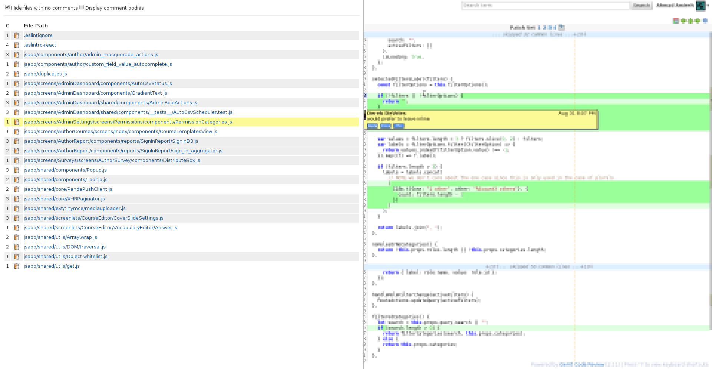

# gerrit-f-button

Baby, the F button is back.



## Installation

There are two ways to use this super cool script: either by installing it
globally for all users, or by injecting it into the page to keep all the
cool to yourself.

### Global installation (all users)

Download the script and place it inside the `$site_path/static` directory
of your Gerrit installation. Then you only need to inject in one of the
Gerrit theme files, like `etc/GerritSiteHeader.html` if you're using the default theme:

```html
<div>
  <script src="static/gerrit-f-button.js"></script>
</div>
```

You *will* need jQuery, so if you don't have it, load it from the
CDN before loading the script:

```html
<div>
  <script src="https://code.jquery.com/jquery-3.1.0.min.js"></script>
  <script src="static/gerrit-f-button.js"></script>
</div>
```

Make sure to restart Gerrit once this is all done. Press F in one
of the patchset pages and bask yourself in glory.

### Local installation

Use something like [greasemonkey](http://www.greasespot.net/) to inject the
script `gerrit-f-button.js`. It inlines all the CSS it needs and should work
in such an environment without any modifications.

I used [TamperMonkey](http://tampermonkey.net/) on Chrome.

The script expects `Gerrit` and `jQuery` to become available on `window` 
within 30 seconds since it gets loaded, otherwise it will not work. If it works, you can see a message on the console saying "gerrit-f-button" is active or something.

## Usage

Simply press F (or f) when you're viewing a change (or a file in a change revision) to bring up the F-button frame. Please keep in mind that this
script is so cool that it naturally expects users to be as cool (or cooler,
if that's even possible), so if you're lacking on cool, I advise you to
work on that first.

## Changelog

**2.0**

- Files are now displayed in a tree view, upping the glory factor to a 
  Phabricating level (oh-uh)
- Removed the option for showing the comment bodies in-line as it was useless
  within such a confined space (and usually you needed the code context to
  make sense of the comments anyway)

**09/13/2015**

- The popup will no longer show up if you're writing in an `<input />` or a `<textarea />` widgets

## License

MIT